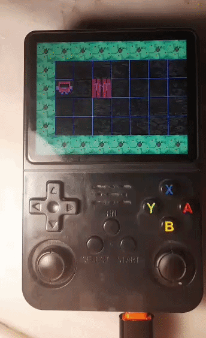

# C-OKOBAN

## Overview

Sokoban game (a.k.a. sukuban) written with C99 using SDL2 library.

Highlights:

- **Multi Platform Support:** Cross Compile-able for ARM
- **OOP Like Structure:** Move-able objects defined with one sturct

## 1. Directory Listings

**main folder:** Contains assets and `main.c`

**src folder:** Contains self written libraries such as `input handling, physics, motion generation`

**include folder:** Contains header files and predefines such as `window size, player size`

## 2. Compilation of code

### Windows (MSYS2/MinGW)

Requires MSYS2 with MinGW64 and SDL2 installed:
```bash
pacman -S mingw-w64-x86_64-SDL2 mingw-w64-x86_64-SDL2_image
```

Then build with the provided Makefile:
```bash
make
```

Output: `sokoban.exe`

To clean:
```bash
make clean
```

### ARM (Cross-compile from WSL2 for R36S)

Requires the aarch64 cross-compiler and a cross-compiled SDL2 sysroot.

**1. Install cross-compiler:**
```bash
sudo apt install gcc-aarch64-linux-gnu g++-aarch64-linux-gnu
sudo dpkg --add-architecture arm64
sudo apt install libdrm-dev:arm64 libgbm-dev:arm64 libegl-dev:arm64
```

**2. Build SDL2 with KMS/DRM support:**
```bash
wget https://github.com/libsdl-org/SDL/archive/refs/tags/release-2.26.2.tar.gz
tar xf release-2.26.2.tar.gz && cd SDL-release-2.26.2
mkdir build-aarch64 && cd build-aarch64

PKG_CONFIG_PATH=/usr/lib/aarch64-linux-gnu/pkgconfig \
PKG_CONFIG_LIBDIR=/usr/lib/aarch64-linux-gnu/pkgconfig \
cmake .. \
  -DCMAKE_SYSTEM_NAME=Linux \
  -DCMAKE_SYSTEM_PROCESSOR=aarch64 \
  -DCMAKE_C_COMPILER=aarch64-linux-gnu-gcc \
  -DCMAKE_CXX_COMPILER=aarch64-linux-gnu-g++ \
  -DCMAKE_INSTALL_PREFIX=$HOME/aarch64-sysroot/usr \
  -DSDL_STATIC=ON -DSDL_SHARED=OFF \
  -DSDL_KMSDRM=ON -DSDL_X11=OFF -DSDL_WAYLAND=OFF

make -j$(nproc) && make install
```

**3. Build SDL2_image:**
```bash
wget https://github.com/libsdl-org/SDL_image/archive/refs/tags/release-2.6.3.tar.gz
tar xf release-2.6.3.tar.gz && cd SDL_image-release-2.6.3
mkdir build-aarch64 && cd build-aarch64

cmake .. \
  -DCMAKE_SYSTEM_NAME=Linux \
  -DCMAKE_SYSTEM_PROCESSOR=aarch64 \
  -DCMAKE_C_COMPILER=aarch64-linux-gnu-gcc \
  -DCMAKE_CXX_COMPILER=aarch64-linux-gnu-g++ \
  -DCMAKE_INSTALL_PREFIX=$HOME/aarch64-sysroot/usr \
  -DSDL2_DIR=$HOME/aarch64-sysroot/usr/lib/cmake/SDL2 \
  -DBUILD_SHARED_LIBS=OFF \
  -DSDL2IMAGE_SAMPLES=OFF \
  -DSDL2IMAGE_VENDORED=ON

make -j$(nproc) && make install
```

**4. Compile the game:**
```bash
aarch64-linux-gnu-gcc main.c src/*.c -o mygame \
  -I./include \
  -I$HOME/aarch64-sysroot/usr/include/SDL2 \
  -L/usr/lib/aarch64-linux-gnu \
  -lSDL2_image -lSDL2 -lm -lpthread -ldl
```

**5. Deploy to device:**
```bash
scp mygame root@<device-ip>:/storage/custom/
```

**6. Run on device (kill EmulationStation first):**
```bash
systemctl stop emustation
LD_LIBRARY_PATH=/usr/lib/glesonly:/usr/lib/mali:/usr/lib ./mygame
```
## Screenshots


